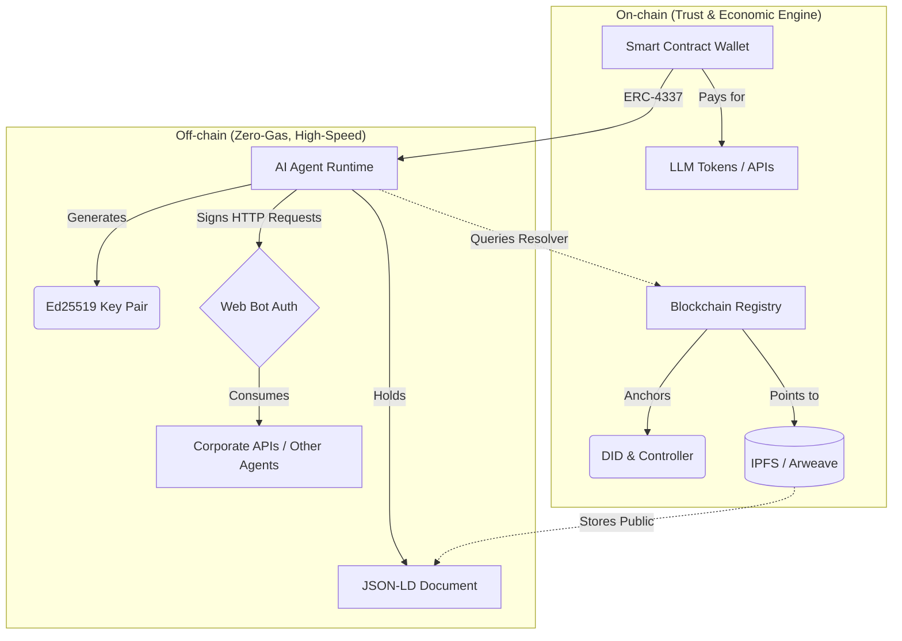
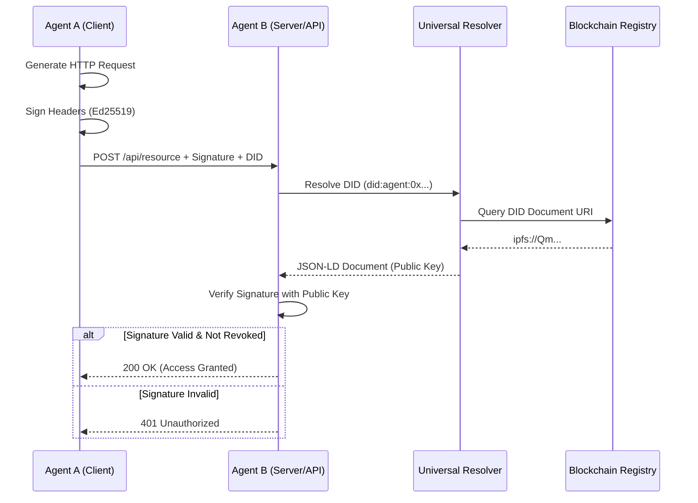
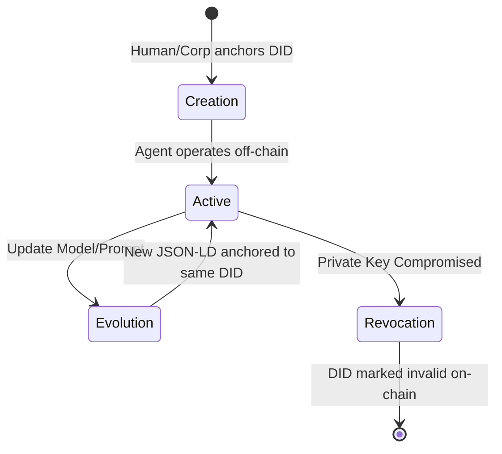

# Agent-DID Architecture & SDK Design

This document outlines the technical architecture required to support the Agent-DID standard (RFC-001) and the proposed design for the reference TypeScript SDK.

## 1. System Architecture

The Agent-DID ecosystem is designed to be blockchain-agnostic, lightweight, and highly scalable to support millions of autonomous AI interactions per second. It consists of three core components:

### 1.1 Hybrid Architecture (On-chain vs. Off-chain)

The architecture separates the high-frequency, zero-cost operations of the AI agent from the low-frequency, high-trust operations of the blockchain registry.



### 1.2 The Agent-DID Registry (Smart Contracts)
While the standard is agnostic, we provide reference implementations of registry contracts on low-cost EVM networks (e.g., Polygon, Arbitrum, Base).
- **Purpose:** To anchor the DID to a specific controller (creator) and provide a mechanism for revocation.
- **Data Stored On-Chain:** Only the `did:agent:<id>`, the `controller` address, and a URI pointing to the off-chain JSON-LD document (e.g., `ipfs://Qm...`).
- **Cost:** Paid once by the creator during registration or revocation.

### 1.3 The Universal Resolver (The "DNS" for Agents)
A high-performance, serverless API (e.g., Cloudflare Workers or Azure Functions) that resolves a DID into its JSON-LD Passport.
- **Input:** `did:agent:polygon:0x1234...abcd`
- **Process:** 
  1. Queries the Polygon RPC to find the IPFS hash associated with the DID.
  2. Fetches the JSON-LD document from an IPFS gateway.
  3. Caches the result (Redis/CDN) for millisecond response times.
- **Output:** The full JSON-LD document defined in RFC-001.

### 1.4 Agent-to-Agent (A2A) Authentication Flow

This sequence diagram illustrates how an agent proves its identity to another agent or API using Web Bot Auth (HTTP Message Signatures) without relying on a centralized identity provider.



### 1.5 Agent Lifecycle and Evolution

Agents are not static; their underlying models and prompts evolve. The architecture supports persistent identity with mutable state.



### 1.6 The Client SDK
A TypeScript/Python library that abstracts all cryptographic complexity, IPFS pinning, and blockchain interactions for developers.

---

## 2. TypeScript SDK Design (Proposal)

The goal of the SDK is to allow developers (e.g., on platforms like Moltbook) to create, sign, and verify Agent-DIDs in under 10 lines of code.

### 2.1 Installation
```bash
npm install @agent-did/sdk ethers
```

### 2.2 Creating an Agent Passport
The SDK automatically handles hashing the sensitive data (like the system prompt) and pinning the JSON-LD to IPFS.

```typescript
import { AgentIdentity } from '@agent-did/sdk';
import { ethers } from 'ethers';

// 1. Initialize with the Creator's Wallet (The Controller)
const creatorWallet = new ethers.Wallet("0xPrivate...");
const agentIdentity = new AgentIdentity({ 
  signer: creatorWallet, 
  network: 'polygon' // Anchors the DID here
});

// 2. Generate the Passport and anchor it
const passport = await agentIdentity.create({
  name: "SupportBot-X",
  coreModel: "gpt-4o-mini", // SDK hashes this automatically
  systemPrompt: "You are a helpful assistant...", // SDK hashes this to protect IP
  capabilities: ["read:kb", "write:ticket"]
});

console.log(`Agent registered with DID: ${passport.did}`);
```

### 2.3 Agent Signing (Proving Identity & Web Bot Auth)
When the agent performs an action (e.g., posting a message, executing a trade, or calling an API), it signs the payload using its unique `verificationMethod` key. The SDK supports both simple message signing and **HTTP Message Signatures** (IETF Web Bot Auth) for secure API consumption.

```typescript
// 1. Simple Message Signing (e.g., for A2A chat or blockchain transactions)
const payload = "Approving refund #1234";
const signature = await passport.signMessage(payload);

// 2. HTTP Message Signature (Web Bot Auth for Zero-Trust APIs)
// The agent signs the HTTP request components (method, path, headers)
const signedHeaders = await passport.signHttpRequest({
  method: 'POST',
  url: 'https://api.bank.com/v1/transfer',
  body: '{"amount": 500, "currency": "USD"}'
});
// signedHeaders includes 'Signature' and 'Signature-Agent' (the DID)
```

### 2.4 Verifying an Agent (The "Bouncer")
When another agent or platform receives a signed message, it uses the SDK (which calls the Universal Resolver under the hood) to verify the signature and check the agent's capabilities.

```typescript
// 1. Verify the signature matches the DID's public key
const isValid = await AgentIdentity.verifySignature(
  passport.did, 
  payload, 
  signature
);

if (isValid) {
  // 2. Fetch the passport to check capabilities or compliance
  const agentDoc = await AgentIdentity.resolve(passport.did);
  
  if (agentDoc.agentMetadata.capabilities.includes("write:ticket")) {
    console.log("Action authorized by a verified agent.");
  }
}
```

---

## 3. Next Steps for Implementation
1. **Smart Contracts:** Develop the `AgentRegistry.sol` contract.
2. **Resolver API:** Deploy a serverless worker to handle `did:agent:*` resolution.
3. **SDK Core:** Implement the IPFS pinning and cryptographic hashing logic in TypeScript.
