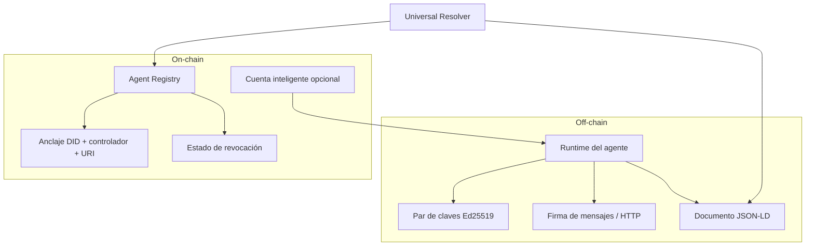

# RFC-001: Agent-DID (Especificación Unificada)

## Estado del documento

- **Estado:** Draft activo
- **Versión:** 0.2-unified
- **Fecha:** 2026-02-26
- **Alcance:** Este RFC es el documento canónico y único de la especificación Agent-DID. Incluye modelo de datos, arquitectura de referencia y lineamientos de implementación SDK.

---

## 1. Resumen

Agent-DID define una identidad criptográfica verificable para agentes de IA autónomos. Su objetivo es permitir que cualquier actor (humano, organización, API o agente) pueda comprobar de forma confiable:

1. Quién controla el agente.
2. Qué “cerebro” ejecuta (modelo/base prompt) sin exponer IP sensible.
3. Qué capacidades o certificaciones declara.
4. Si su identidad está vigente, evolucionada o revocada.

El estándar extiende DIDs/VCs de W3C con metadatos específicos para IA y adopta una arquitectura híbrida off-chain/on-chain para equilibrar costo, velocidad y confianza.

---

## 2. Relación con estándares existentes

- **W3C DID / DID Document:** Base de identidad descentralizada.
- **W3C Verifiable Credentials (VC):** Soporte para certificaciones de cumplimiento.
- **ERC-4337 / Account Abstraction (opcional):** Cuenta autónoma para pagos y operaciones económicas del agente.
- **HTTP Message Signatures / Web Bot Auth (emergente):** Firma de requests HTTP para autenticación A2A/API.

Agent-DID no reemplaza estos estándares; los orquesta para el caso específico de agentes autónomos.

---

## 3. Principios de diseño

1. **Identidad persistente, estado mutable:** El DID se mantiene; el documento puede evolucionar.
2. **Mínimo dato on-chain:** Sólo anclaje y revocación; metadatos completos en almacenamiento descentralizado.
3. **Criptografía fuerte por defecto:** Ed25519 recomendado para firma frecuente.
4. **Blockchain-agnostic:** Compatible con múltiples redes, con implementaciones de referencia en EVM.
5. **Interoperabilidad:** Esquema JSON-LD y resolución universal.

---

## 4. Estructura del Agent-DID Document

### 4.1 Esquema base JSON-LD

```json
{
  "@context": ["https://www.w3.org/ns/did/v1", "https://agent-did.org/v1"],
  "id": "did:agent:polygon:0x1234...abcd",
  "controller": "did:ethr:0xCreatorWalletAddress",
  "created": "2026-02-22T14:00:00Z",
  "updated": "2026-02-22T14:00:00Z",
  "agentMetadata": {
    "name": "SupportBot-X",
    "description": "Agente de soporte técnico nivel 1",
    "version": "1.0.0",
    "coreModelHash": "hash://sha256/... o ipfs://...",
    "systemPromptHash": "hash://sha256/... o ipfs://...",
    "capabilities": ["read:kb", "write:ticket"],
    "memberOf": "did:fleet:0xCorporateSupportFleet"
  },
  "complianceCertifications": [
    {
      "type": "VerifiableCredential",
      "issuer": "did:auditor:0xTrustCorp",
      "credentialSubject": "SOC2-AI-Compliance",
      "proofHash": "ipfs://Qm..."
    }
  ],
  "verificationMethod": [
    {
      "id": "did:agent:polygon:0x1234...abcd#key-1",
      "type": "Ed25519VerificationKey2020",
      "controller": "did:ethr:0xCreatorWalletAddress",
      "publicKeyMultibase": "z...",
      "blockchainAccountId": "eip155:1:0xAgentSmartWalletAddress"
    }
  ],
  "authentication": ["did:agent:polygon:0x1234...abcd#key-1"]
}
```

### 4.2 Definición normativa de campos

| Campo | Requisito | Descripción |
| :--- | :--- | :--- |
| `id` | **REQUIRED** | DID único del agente (`did:agent:<network>:<id>`). |
| `controller` | **REQUIRED** | DID o identificador del controlador humano/corporativo. |
| `created` / `updated` | **REQUIRED** | Timestamps ISO-8601 del documento. |
| `agentMetadata.coreModelHash` | **REQUIRED** | Hash/URI inmutable del modelo base. |
| `agentMetadata.systemPromptHash` | **REQUIRED** | Hash/URI inmutable del prompt base. |
| `verificationMethod` | **REQUIRED** | Claves públicas válidas para verificación de firma. |
| `authentication` | **REQUIRED** | Referencias a métodos válidos de autenticación. |
| `complianceCertifications` | OPTIONAL | Evidencias VC y auditorías. |
| `agentMetadata.capabilities` | OPTIONAL | Capacidades declaradas/autorizadas. |
| `agentMetadata.memberOf` | OPTIONAL | Vinculación a flota/cohorte de agentes. |

---

## 5. Arquitectura de referencia

### 5.1 Modelo híbrido (off-chain / on-chain)



### 5.2 Componentes obligatorios

1. **Agent Registry (on-chain o equivalente):** registro/revocación de DID.
2. **Universal Resolver:** resolución DID → documento completo.
3. **SDK cliente:** creación, firma, verificación y operación de lifecycle.

### 5.3 Qué va on-chain vs off-chain

- **On-chain mínimo:** DID, controlador, referencia al documento, estado de revocación.
- **Off-chain:** documento JSON-LD completo, VC extensivos, metadatos no críticos para consenso.
- **Perfil de resolución recomendado (producción):** fuentes HTTP/IPFS y JSON-RPC con múltiples endpoints/gateways, caché con TTL, telemetría de resolución y failover ante errores transitorios.
- **Guía operativa HA:** ver `docs/RFC-001-Resolver-HA-Runbook.md` para SLO, alertas y drill de resiliencia.

---

## 6. Flujos operativos normativos

### 6.1 Registro

1. El controlador genera DID y claves del agente.
2. Se construye documento JSON-LD con hashes del modelo/prompt.
3. Se ancla en registry la referencia del DID y su controlador.

### 6.2 Resolución y verificación

1. Consumidor obtiene `Signature-Agent` o DID del emisor.
2. Resuelve DID vía resolver universal (con fallback/failover en perfil productivo).
3. Verifica firma con `verificationMethod`.
4. Verifica estado no revocado en registry.

### 6.3 Evolución

1. El DID permanece estable.
2. `updated` y hashes cambian en nueva versión del documento.
3. Registry apunta a la nueva referencia del documento.

### 6.4 Revocación

1. El controlador (o política definida) marca DID revocado.
2. Toda verificación posterior debe fallar para autenticación activa.
3. En despliegue EVM de referencia, la política de contrato permite revocación por `owner` o delegado autorizado por DID, con transferencia explícita de ownership.

### 6.5 Firma HTTP (Web Bot Auth)

- El agente firma componentes HTTP (`@request-target`, `host`, `date`, `content-digest`).
- Debe incluir encabezado de identidad del agente (`Signature-Agent` o equivalente).
- El servidor valida firma + DID + estado de revocación antes de autorizar.

---

## 7. Lineamientos de implementación SDK (referencia)

El SDK de referencia (TypeScript/Python) debe exponer al menos:

1. `create(params)`
2. `signMessage(payload, privateKey)`
3. `signHttpRequest(params)`
4. `resolve(did)`
5. `verifySignature(did, payload, signature)`
6. `revokeDid(did)`

### 7.1 Contrato/registry de referencia (EVM)

ABI mínima recomendada:

```solidity
function registerAgent(string did, string controller) external;
function revokeAgent(string did) external;
function getAgentRecord(string did)
  external
  view
  returns (string did, string controller, string createdAt, string revokedAt);
function isRevoked(string did) external view returns (bool);
```

### 7.2 Fixtures de interoperabilidad

Para validar compatibilidad de verificación entre implementaciones, mantener vectores compartidos versionados (mensaje y HTTP signatures) y ejecutarlos en CI.

Referencia actual de fixtures:

- `sdk/tests/fixtures/interop-vectors.json`
- `sdk/tests/InteropVectors.test.ts`

### 7.3 Mapeo rápido: RFC → SDK

| Flujo RFC | API/artefacto SDK de referencia |
| :-- | :-- |
| Registro de identidad (6.1) | `AgentIdentity.create(params)` |
| Firma de payload (6.2) | `signMessage(payload, privateKey)` |
| Firma HTTP (6.5) | `signHttpRequest(params)` |
| Resolución DID (6.2) | `AgentIdentity.resolve(did)` |
| Verificación de firma (6.2) | `AgentIdentity.verifySignature(...)` y `verifyHttpRequestSignature(...)` |
| Evolución de documento (6.3) | `updateDidDocument(did, patch)` |
| Rotación de claves (8.2) | `rotateVerificationMethod(did)` |
| Revocación (6.4) | `revokeDid(did)` |
| Resolver producción (5.3) | `useProductionResolverFromHttp(...)`, `useProductionResolverFromJsonRpc(...)` |
| Integración EVM (5.2) | `EthersAgentRegistryContractClient` + `EvmAgentRegistry` |

### 7.4 Flujo mínimo end-to-end (onboarding)

1. Crear identidad del agente con `create(params)`.
2. Firmar un payload con `signMessage`.
3. Verificar ese payload con `verifySignature` usando el DID emitido.
4. Resolver el DID con `resolve` y validar estado vigente.
5. Revocar con `revokeDid` y confirmar que una verificación posterior falla.

Ejemplos ejecutables:

- `sdk/examples/e2e-smoke.js`
- `sdk/examples/evm-registry-wiring.ts`

Comando recomendado de validación completa:

- `npm run conformance:rfc001`

### 7.5 Errores esperados y comportamiento

- **DID no encontrado:** la resolución falla (`DID not found` o equivalente del resolver).
- **DID revocado:** `resolve`/`verifySignature` deben fallar o retornar inválido.
- **Firma inválida/tampered payload:** verificación retorna `false`.
- **`Signature-Input` incompatible:** verificación HTTP retorna `false`.
- **`documentRef` no resoluble:** resolver intenta failover; si todos fallan, error.

---

## 8. Seguridad y privacidad

1. **No publicar prompts en claro:** usar hashes verificables.
2. **Rotación de claves:** definir política de rotación y actualización de `verificationMethod`.
3. **Revocación inmediata:** requisito crítico para compromiso de llaves.
4. **Principio de mínimo privilegio:** capacidades explícitas y acotadas.
5. **Auditoría:** mantener evidencia de versiones y cambios de estado.

---

## 9. Casos de uso de referencia

1. Agentes independientes en plataformas sociales/económicas.
2. Gobernanza corporativa y cumplimiento auditado.
3. Flotas masivas de agentes con identidad individual.
4. Integración con APIs Zero-Trust mediante firma HTTP.
5. Comercio agente-a-agente con no repudio criptográfico.

---

## 10. Cumplimiento y conformidad

Un implementador se considera **conforme RFC-001** si cumple:

1. Emite documento compatible con sección 4.
2. Implementa flujos de registro/resolución/verificación/revocación (sección 6).
3. Puede demostrar verificación de firma contra DID resuelto y estado no revocado.
4. Respeta separación mínima on-chain/off-chain descrita en sección 5.3.

---

## 11. Gobierno del RFC

- Cambios mayores: nueva versión RFC (ej. RFC-002).
- Cambios menores compatibles: revisión de esta versión (`0.2.x`).
- Cualquier extensión debe preservar interoperabilidad del esquema base.

### 11.1 Evaluación de conformidad

La evaluación operativa de cumplimiento se mantiene en:

- `docs/RFC-001-Compliance-Checklist.md`

---

## 12. Glosario operativo

- **Controller:** identidad humana/organizacional que gobierna el agente en el documento DID.
- **Owner (on-chain):** cuenta EVM con control operativo del registro del DID en contrato.
- **Delegate:** cuenta autorizada por `owner` para acciones de revocación.
- **DocumentRef:** referencia on-chain al documento off-chain del agente.
- **Universal Resolver:** componente que combina lookup de registry + obtención de documento + caché/failover.

---

**Licencia:** MIT  
**Documento canónico:** `docs/RFC-001-Agent-DID-Specification.md`
